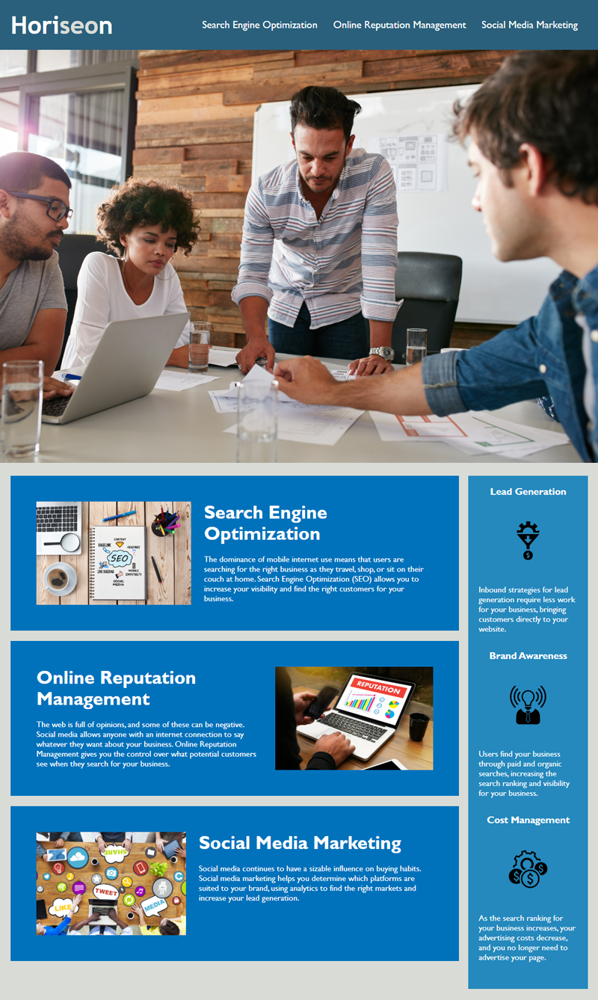

# Project Name
# Horiseon marketing agency

---

In this application I have refactored marketing agency's existing web site code to make it more accessible.
I have optimized this site for search engines.

## Description
This is my first homework assignment for my coding bootcamp class.
This application is following the structure of semantic HTML elements.
I have added alt attribute for all img tags to increase accessiblity.
In this application CSS classes and id's are consolidated and organized.
Checked all links in the application.  It is working correctly. 
This application is structured properly. 

## Link

https://kannavairavan.github.io/HW1_coderefactor/#social-media-marketing

### Technologies 

Visual Studio code, HTML5  and CSS

